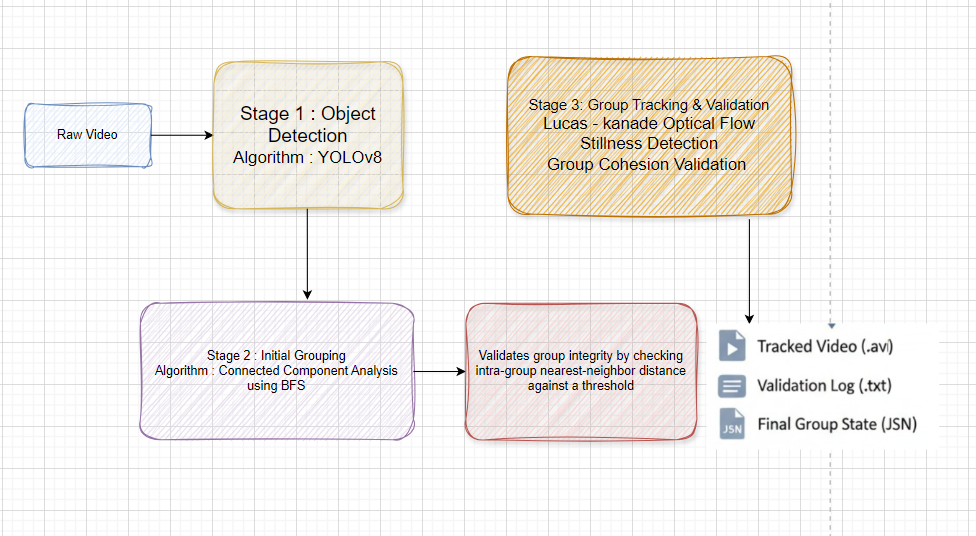

# Head Detection and Group Tracking for Crowd Monitoring

Automated pipeline for detecting heads in video, grouping them by proximity, and tracking these groups across frames using optical flow. Built for portability, clarity, and modular expansion.

## Pipeline Architecture

Pipeline for the project:



## Project Structure

### `config.py`

Centralized control file for all parameters:
paths, model names, thresholds, visualization settings, and processing flags.

### `utils.py`

Utility module containing shared logic:
radius estimation, dot extraction, JSON management, geometric helpers.

### `main.py`

Primary controller script executing the complete three-stage system:

**1. Detection**
Runs YOLOv8 to detect heads and produce dot-annotated intermediate videos.

**2. Grouping**
Uses BFS on the initial frame to cluster detected heads based on proximity.

**3. Tracking**
Tracks groups using Lucas-Kanade optical flow, maintaining cohesion and removing static entities.

### `requirements.txt`

Package list for environment preparation.

### `0_input_videos/`

Storage for raw input videos (`.mp4`, `.avi`, etc.).

### `models/`

Directory for the YOLO model file (`best.pt` or equivalent).

### `output/`

Generated automatically. Contains all processed results:

```
output/
├── 1_dot_videos/
│   └── example_video_dots.avi
├── 2_init_frames/
│   ├── example_video_dots_groups.jpg
│   └── example_video_dots_groups.json
├── 3_tracked_videos/
│   ├── example_video_dots_tracked.avi
│   └── example_video_dots_final_groups.json
└── 4_validation_logs/
    └── example_video_dots_validation.log
```


## Installation

Install dependencies:

```
pip install -r requirements.txt
```

## Preparation

Place input videos into:

```
0_input_videos/
```

Place the YOLO model file into:

```
models/
```

## Execution

Execute the main script:

```
python main.py
```

The system automatically discovers all videos inside `0_input_videos/`, runs them through detection, grouping, and tracking, and saves the complete output to the `output/` directory.
